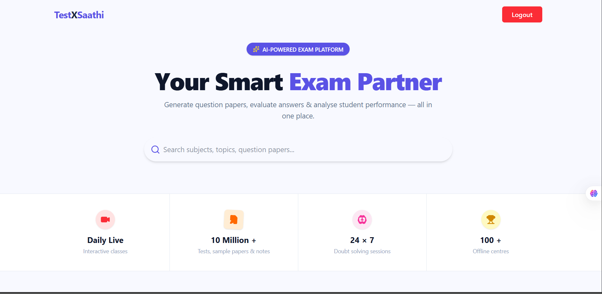
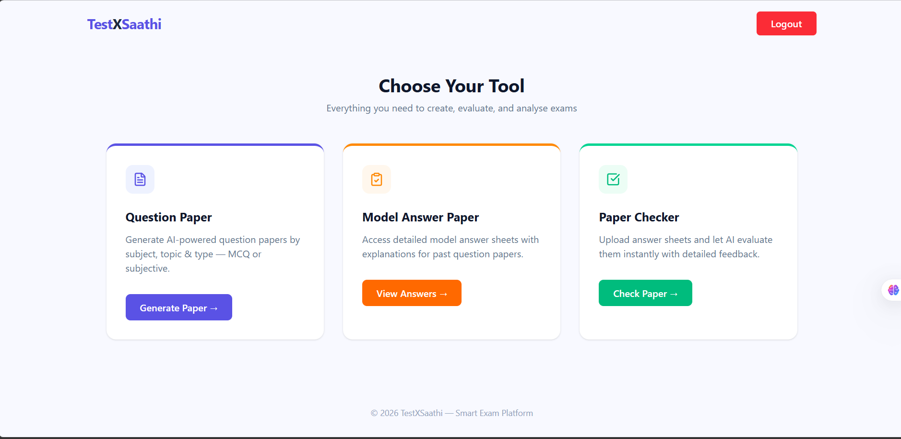
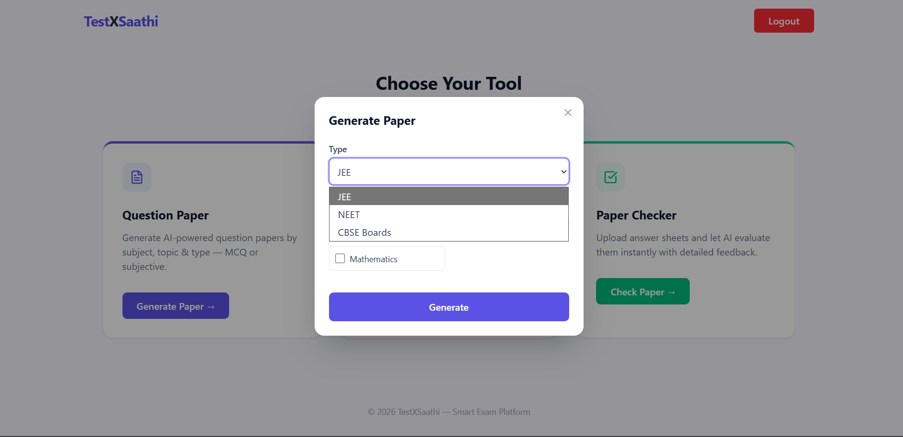
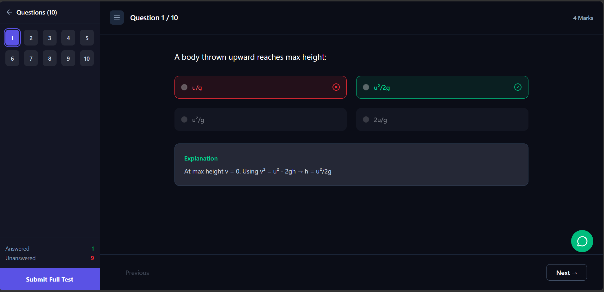
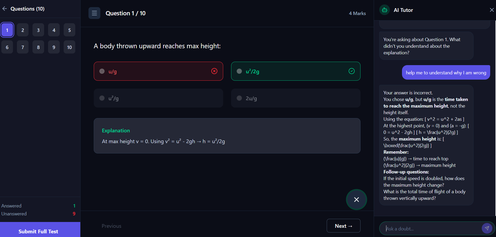
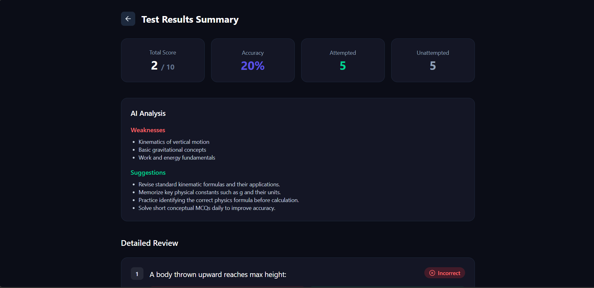
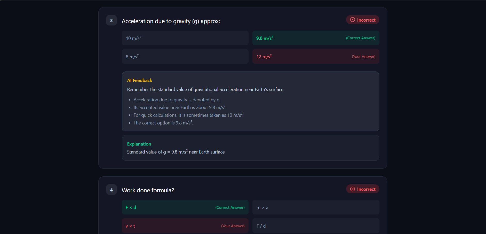
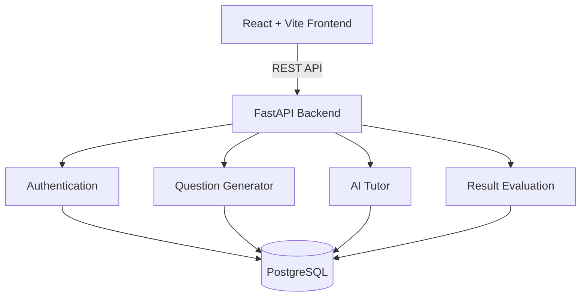

# 🚀 TestXSaathi

> AI-Powered Examination & Learning Platform

TestXSaathi is a full-stack web application that enables students to generate AI-powered mock question papers, attempt exams online, receive instant AI-based feedback, and analyze their performance through detailed reports.

The platform has been designed with a modular architecture using React and FastAPI and is deployed as independent frontend and backend services.

---

## 🌐 Live Demo

Frontend:
https://test-x-sathi.vercel.app/

Backend:
https://parikshasathibackend.onrender.com/

## 📦 Repositories

Frontend Repository

https://github.com/vishalsachan123/TestXSathiFrontend

Backend Repository

https://github.com/vishalsachan123/ParikshaSathi

## 📖 Problem Statement

Students preparing for competitive examinations often rely on static question papers that provide limited feedback after completion.

TestXSaathi addresses this problem by providing an AI-assisted examinaion platform capable of

• Generating mock examinations

• Conducting online practice tests

• Evaluating student answers

• Providing AI-generated explanations

• Identifying weak topics

• Offering personalized learning suggestions

The objective is to simulate a real examination environment while improving learning through intelligent feedback.

## ✨ Features

### Authentication

- Secure Login
- User Registration
- JWT Authentication

### AI Question Paper Generator

- Generate mock exams
- Subject selection
- Topic selection
- Multiple exam types
- Randomized questions

### Online Examination

- Timer
- Question Navigator
- Submit anytime
- Responsive interface

### AI Evaluation

- Instant result generation
- Correct answer highlighting
- AI explanations
- Personalized feedback

### AI Tutor

- Interactive doubt solving
- Follow-up questions
- Concept explanations
- Context-aware responses

### Performance Analysis

- Score
- Accuracy
- Attempt statistics
- Weak topic analysis
- Improvement suggestions

### Responsive UI

- Desktop support
- Tablet support
- Mobile-friendly layouts

## Screenshots

### Landing Page





---

### Generate Question Paper



---

### Online Test



---

### AI Tutor



---

### Result Summary



---

### AI Analysis



## 🏗️ System Architecture



## 🛠 Tech Stack

| Layer          | Technology              |
| -------------- | ----------------------- |
| Frontend       | React, TypeScript, Vite |
| Backend        | FastAPI, Python         |
| Database       | PostgreSQL              |
| Authentication | JWT                     |
| AI             | Azure OpenAI, AI Search |
| DevOps         | Docker, GitHub Actions  |
| Deployment     | Vercel, Render          |


## 📂 Project Structure

### Backend (`ParikshaSathi`)

```text
ParikshaSathi/
├── src/
│   ├── account/          # Authentication APIs
│   ├── data_models/      # Pydantic request/response models
│   ├── db/               # Database configuration
│   ├── generations/      # AI question generation & evaluation APIs
│   ├── log_here/         # Logging configuration
│   ├── prompts/          # LLM prompt templates
│   ├── sample_data/      # Sample datasets
│   ├── services/         # Azure OpenAI & business logic
│   ├── __init__.py
│   └── main.py
├── Dockerfile
├── requirements.txt
├── env_guide.txt
└── .env
```

### Frontend (`TestXSathiFrontend`)

```text
TestXSathiFrontend/
├── public/
├── src/
│   ├── assets/
│   ├── components/
│   ├── pages/
│   ├── App.tsx
│   └── main.tsx
├── package.json
└── vite.config.ts
```

### Core Modules

**Authentication**

- User registration and login
- JWT-based authentication
- Protected routes

**Question Paper Generation**

- Generate mock exams by subject and difficulty
- AI-assisted question generation
- Configurable exam patterns

**Online Examination**

- Question navigation
- Auto submission and evaluation

**Result Analysis**

- Score calculation
- Performance summary
- AI-generated feedback and improvement suggestions

**AI Tutor**

- Ask doubts related to attempted questions
- Context-aware explanations
- Interactive learning experience

**Backend Services**

- RESTful APIs built with FastAPI
- Input validation using Pydantic
- PostgreSQL database integration


## 🔌 API Endpoints

### Authentication

| Method | Endpoint         | Description         |
| ------ | ---------------- | ------------------- |
| POST   | `/auth/signup` | Register a new user |
| POST   | `/auth/signin` | Authenticate user   |

### AI Generation

| Method | Endpoint                 | Description                         |
| ------ | ------------------------ | ----------------------------------- |
| POST   | `/gen/evaluateAnswers` | Evaluate submitted answers using AI |
| POST   | `/gen/api/chat`        | AI Tutor for question explanations  |

### Utility

| Method | Endpoint    | Description              |
| ------ | ----------- | ------------------------ |
| GET    | `/`       | Health Check             |
| GET    | `/docs`   | Swagger Documentation    |
| GET    | `/scalar` | Scalar API Documentation |


## 🏗 Production Ready Features

- Modular architecture
- RESTful API design
- JWT Authentication
- Dockerized backend
- Environment-based configuration
- GitHub Actions CI/CD
- Exception handling
- API validation
- Responsive UI
- Cloud deployment

## ⚙️ Environment Variables

### Frontend (`.env`)

```env
VITE_API_BASE_URL=http://localhost:8000
```

### Backend (`.env`)

```env
DATABASE_URL=your_postgresql_connection
SECRET_KEY=your_secret_key
ALGORITHM=HS256
ACCESS_TOKEN_EXPIRE_MINUTES=30

OPENAI_API_KEY=your_api_key
OPENAI_ENDPOINT=your_endpoint
MODEL_NAME=your_model_name
```

## ⚡ Quick Start

Clone both repositories

```bash
git clone https://github.com/vishalsachan123/ParikshaSathi.git

git clone https://github.com/vishalsachan123/TestXSathiFrontend.git
```

### Backend

```bash
cd ParikshaSathi
python -m venv .venv
pip install -r requirements.txt
uvicorn src.main:app --reload
```

Runs on

```
http://localhost:8000
```

### Frontend

```bash
cd TestXSathiFrontend
npm install
npm run dev
```

Runs on

```
http://localhost:5173
```

## 🚀 Deployment

| Service          | Platform       |
| ---------------- | -------------- |
| Frontend         | Vercel         |
| Backend          | Render         |
| Database         | PostgreSQL     |
| Containerization | Docker         |
| CI/CD            | GitHub Actions |

## 📈Future Scope

The following enhancements are planned.

- AI semantic search for question discovery
- Redis caching for improved performance
- Student progress dashboard
- Personalized learning recommendations
- Question recommendation engine
- Detailed analytics
- Centralized structured logging
- Monitoring & Health Checks
- GitHub Actions CI/CD improvements
- Role-Based Access Control
- Rate limiting
- Email notifications
- AI-powered descriptive answer evaluation
- Vector database integration

## 👨‍💻 About Me

Hi, I'm **Vishal Sachan**, a Software Engineer passionate about building scalable AI-powered applications using FastAPI, React, Python, and Large Language Models.

📧 Email: mrvishalpatel673@gmail.com

🌐 Portfolio: https://vishalsachan123.github.io

💼 LinkedIn: https://www.linkedin.com/in/vishal-sachan-py/

💻 LeetCode: https://leetcode.com/u/vishalsachan/
